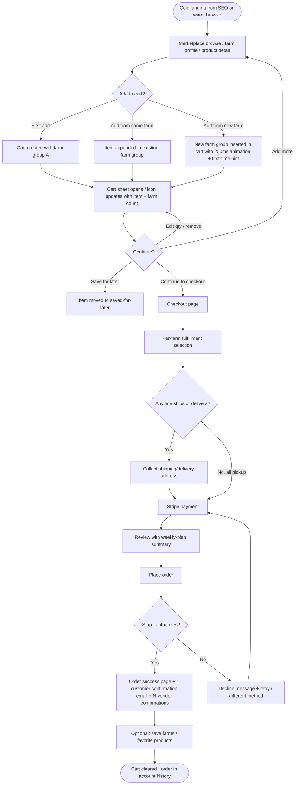
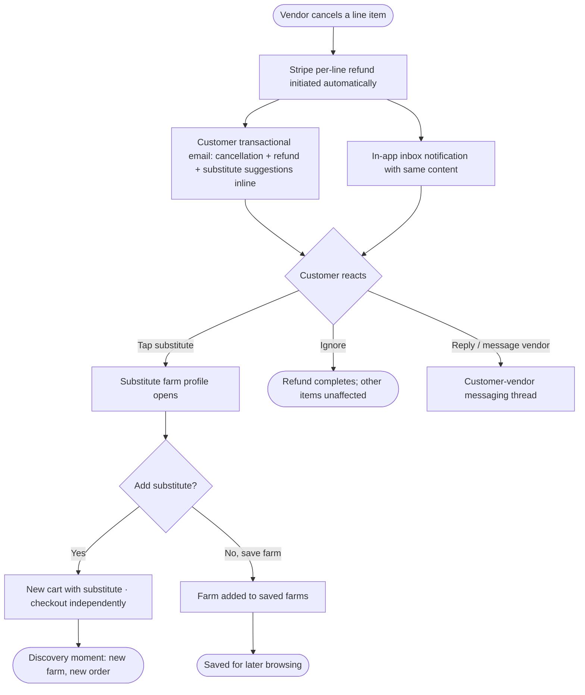
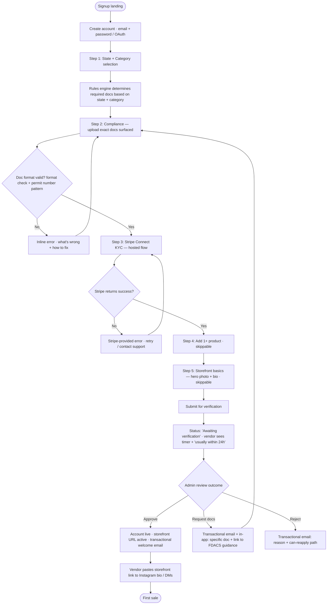
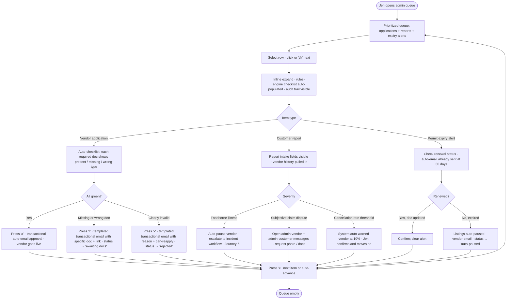
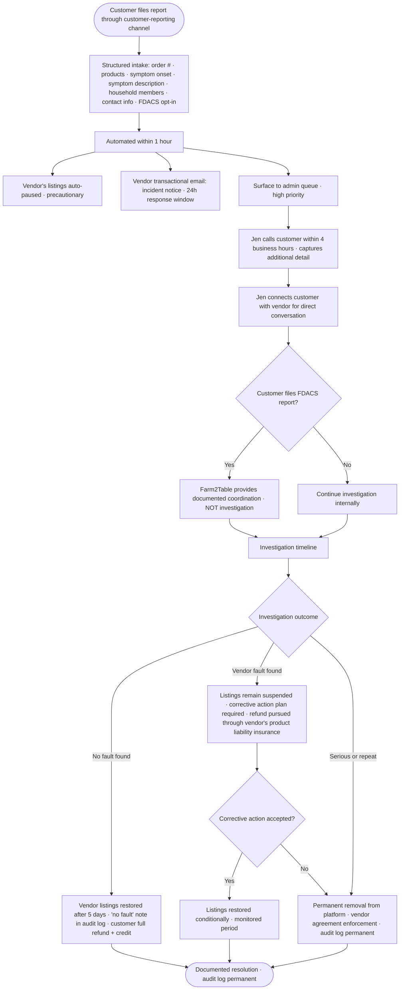

# UX Design Specification — Farm2Table

**Author:** Jen
**Date:** 2026-04-26

---

## Executive Summary

### Project Vision

Farm2Table is a two-sided D2C marketplace connecting consumers directly with named local farmers and artisan food producers — built around a **multi-farm cart with named-farm provenance** (one cart from multiple farms; every line item shows the named producer). The model is national from day one, rolling out metro-by-metro: **Gainesville pilot (Oct 2026) → Sarasota commercial launch (Feb 13, 2027) → additional metros as traction permits → 50-metro national footprint at maturity.** No competitor currently occupies the multi-farm-cart whitespace.

### Target Users

**Customers**
- **Primary — Sarah, 36 (Sarasota mom, ~$110K HH income).** Health-conscious millennial/Gen X parent; cooks at home; CSA mystery-box-fatigued; distrusts grocery "local" stickers. Sunday-night-kitchen-table use case. Mobile-first.
- **Secondary — adult children buying for aging parents.** Snowbird/65+ demographic via proxy. WCAG 2.1 AA mandatory consumer-facing.

**Vendors**
- **Tier A — Mike, 34, cottage-food sourdough baker.** Instagram DMs + Venmo chaos; needs frictionless 24-minute onboarding through Stripe Connect KYC.
- **Tier B — Tom, 51, established pastured-egg producer.** Has own Shopify + email list; treats Farm2Table as incremental channel, not replacement.
- **Tier C — mature $10K+/mo GMV vendors.** Pro tier (12% commission) cost-savings angle vs. Market Wagon (20–30%).

**Admin**
- **Jen, founder, sole admin at launch.** ~3 hrs/week verification; rules engine + AI-assist keep this sub-linear as vendor count grows.

**Implicit regulatory audience.** FDACS, state revenue departments, FDA — interact via documentation and audit trail, no UI.

### Key Design Challenges

1. **Multi-vendor cart paradigm.** Never done at scale in this category. The wedge *is* the friction; UX must convert "one cart, multiple pickup/delivery/ship destinations and times" into orientation rather than chaos.
2. **Per-vendor fulfillment selection at checkout.** Likely the hardest screen in the product. Mix of farm-pickup windows, zip-based local-delivery fees, shipping methods, cottage-food in-state defaults. This is where Failure Mode #2 (multi-pickup friction → churn) lives.
3. **Provenance density without overwhelm.** Each product card carries named farm, cert badges (AWA / USDA Organic / CNG), location, practice tags, fulfillment method, lot/batch fields. The information architecture is simultaneously the differentiator and the risk.
4. **Mobile-first at 320px.** Galaxy Fold floor. Card layouts, touch targets (44×44pt / 48dp), modals, the multi-vendor cart's per-farm grouping, and the fulfillment selector all need to work at this width.
5. **Vendor onboarding for non-technical cottage-food bakers.** Mike's 24-minute target. Cannot feel like SaaS; must feel like "set up a stand at the market."
6. **Compliance rules engine as helper, not bureaucracy.** Vendors see only the docs *they* need based on (state, category, products); admin sees a green/red pre-built checklist. UX must feel like guidance, not regulatory homework.
7. **Vendor cancellation as a discovery moment.** Journey 2's "substitute surfacing" pattern turns churn into expansion. High-leverage moment, easy to design poorly.
8. **SEO landing pages as primary cold-acquisition surface.** "buy pastured eggs Sarasota" → conversion. National scope means this scales to every metro × every product category.
9. **WCAG 2.1 AA non-negotiable consumer-facing** — driven by snowbird demographic AND ADA Title III lawsuit risk.

### Design Opportunities

1. **Named-farm provenance as visual identity.** Farm name, cert badges, producer voice baked into product cards, cart, and confirmations. The brand differentiator made visible — not a feature, the *aesthetic*.
2. **Cart as multi-farm composition.** Group cart by farm with per-farm fulfillment summary ("Frank's Farm — pickup Sat 10am — 2 items"). Reframes complexity as "plan your week of food."
3. **Substitute surfacing as a signature moment.** When a vendor cancels, surface alternatives in-cart and in-email with one-tap to product. Rare design moment that converts disappointment into discovery.
4. **Compliance-as-trust signal.** Surface to consumers that every vendor's permits are verified and tracked. Turns regulatory load into a consumer-facing trust feature.
5. **Vendor single-player mode.** Mike pastes his Farm2Table store link into Instagram bio. Dual-mode UX (marketplace browser AND each vendor's standalone storefront) is a concrete and ownable surface.
6. **Saved farms + favorite products as a parallel "personal pantry."** Both MVP. Reorder flows, "back in season" notifications (Growth), and discovery loops all anchor here.

## Core User Experience

### Defining Experience

**Consumer core loop:** discover farms/products → compose a multi-farm cart → single checkout → receive **one consolidated order confirmation with per-vendor sub-receipts/details inline** → pick up/receive each vendor's items per their fulfillment method → reorder. Defining action: *add items from multiple named farms to one cart and check out once.*

**Vendor core loop:** onboard with state+category-aware document requirements → list products → configure fulfillment → receive **per-vendor order confirmations for their items only** → fulfill → get paid in 7 days. Defining action: *list once, manage incoming orders without the DM-and-Venmo chaos.*

**Admin core loop:** triage queue (vendor applications + customer reports + permit-expiry alerts) using the rules engine's pre-built checklists → approve / request-info / reject in 90 seconds with state-specific context auto-inserted into templated comms.

### Platform Strategy

- **Mobile-first responsive web only at MVP.** No native iOS/Android (Vision-deferred).
- **Mobile floor: 320px** (Galaxy Fold cover screen, small Android floor) → tablet → desktop.
- **Touch + mouse/keyboard.** Touch targets 44×44pt (HIG) / 48dp (Material).
- **Browsers:** Chrome, Safari, Edge, Firefox latest 2 versions; IE11 receives a graceful-fallback message.
- **Online-only.** No offline mode at MVP. Architecture is event-driven and real-time-ready from day one; user-visible real-time UX (live order status, web push) deferred to Growth.
- **WCAG 2.1 AA mandatory consumer-facing.** Vendor and admin surfaces pragmatic-AA.
- **Device capabilities used:** camera (vendor doc upload, product photos); geolocation optional with zip-based fallback always available.

### Effortless Interactions

1. **Adding items from a second/third farm to the same cart.** One cart, period — no per-farm cart silos.
2. **Reorder from saved farms / favorite products.** One tap from account → cart populated.
3. **Per-vendor fulfillment selection at checkout.** Each farm's options (pickup window / delivery to customer zip / shipping) surface inline; selection happens without leaving the checkout flow.
4. **Vendor document upload during onboarding.** State + category surfaces *exactly* the documents needed; no regulatory homework.
5. **Admin verification approve/reject.** Pre-built green/red checklist; one click + templated comms with state-specific context auto-inserted.

### Critical Success Moments

1. **Sarah's first multi-farm cart completes.** If the cart or checkout feels janky, the wedge fails. *The* moment.
2. **First pickup/delivery happens cleanly.** Frank recognizes the order at hand-off; the bread shows up on the porch with the right tag.
3. **Substitute surfacing after a cancellation.** Disappointment → discovery (Journey 2 pattern).
4. **Mike's first 6 pre-orders through his Instagram-bio store link.** Vendor sees real value within the first week.
5. **Trust moment on cert badge tap.** Cert badge (AWA / USDA Organic / CNG) links to issuing authority — "this is verified, not theater."
6. **First reorder within 30 days** (PRD success criterion ≥40% MVP).

### Experience Principles

1. **Named producers, always.** Every screen, email, and confirmation surfaces the named farm + certifications. Provenance is the brand, not a feature.
2. **One cart, multiple farms, no apology.** Multi-farm shopping is the default mental model. Group by farm, summarize fulfillment per farm, never frame the customer as "juggling separate orders."
3. **Design to the floor.** 320px Galaxy Fold, cottage-food baker on her phone in the kitchen, snowbird-proxy buyer with reading glasses. The floor is the design target, not the desktop.
4. **Compliance as guidance, not bureaucracy.** Rules engine speaks to each user in their voice — vendor: "here's what you need"; admin: "here's what's missing"; consumer: "here's what's verified."
5. **Disappointment becomes discovery.** Cancellations, out-of-stocks, missed cutoffs always surface alternatives in-flow.
6. **Trust through verification, not assertion.** Cert badges link to issuing authorities. Permit status is visible. "Verified" is a process, not a graphic.

## Desired Emotional Response

### Primary Emotional Goals

**Trust + agency.** *"I know exactly who grew this. I chose it. It arrived as promised."*

This is the single emotional differentiator versus every alternative — Whole Foods (anonymous abundance), Instacart (efficient warehousing), CSA (mystery box / no agency), Market Wagon (warehoused "local"). Trust without agency is CSA. Agency without trust is grocery. Farm2Table is both.

### Secondary Feelings (per user)

- **Sarah (consumer):** *quiet pride* and *belonging.* She made a different choice, it worked, she's connected to the people who grew her food. Not virtue-signal pride; the kind you don't post about.
- **Mike (Tier A vendor):** *legitimacy.* "I'm a real seller now, this is a real business" — not a baker who takes Venmos in DMs.
- **Tom (Tier B vendor):** *unguarded competence.* The platform proves itself with incremental orders without asking him to commit, perform, or migrate.
- **Jen (admin):** *supported competence.* Never has to remember a state law; the rules engine front-loads the expertise.

### Emotions to Avoid

- Sarah feeling like she's *juggling three separate orders* (multi-pickup as anxiety).
- Sarah feeling *lectured* — no preachy "support local!" copy or guilt-trip framings.
- Mike feeling *Stripe Connect KYC is a wall* — onboarding anxiety kills the 24-minute target.
- Tom feeling *cornered into upgrading* (auto-tier resentment).
- Any user feeling this is *another sterile SaaS app* — the sin is grocery-warehouse anonymity in a UI that's supposed to be the antidote to grocery-warehouse anonymity.

### Emotional Journey Mapping

**Sarah (consumer):**

| Stage | Desired feeling |
|---|---|
| Lands on SEO page from cold Google search | Curious, slightly hopeful |
| Browses farms / sees real photos + named farmers | Grounded, oriented — "these are real places" |
| Adds first item from a second farm to same cart | Pleasantly surprised — "wait, this works?" |
| Checkout, picks per-farm fulfillment | Confident, in control — not anxious about coordination |
| Confirmation email lands with per-vendor sub-receipts | Anticipation, faintly proud |
| Friday pickup, Frank recognizes the order | Warmth, small recognition |
| Tuesday, jar of honey arrives with a hand-written note | Connection, quiet delight |
| Returns the next Sunday | At home — "this is my new way of buying food" |

**Mike (Tier A vendor):**

| Stage | Desired feeling |
|---|---|
| Hears about it at the Saturday market | Cautiously hopeful |
| State + category surfaces exact docs needed | Unintimidated — "this knows my situation" |
| Stripe Connect KYC | Moving forward, not stalled |
| First pre-order through Instagram bio link | Legitimate — "I'm running a real shop now" |
| Two weeks in, marketplace customer finds him | Validated |

### Design Implications

- **Trust** → cert badges link out to issuing authorities; permit status visible on farm profiles; named producers in every confirmation; farm address shown at vendor-controlled granularity.
- **Agency** → multi-farm cart visible as composition (grouped by farm with per-farm fulfillment summary); per-vendor fulfillment selection inline at checkout; saved farms + favorite products as "personal pantry."
- **Quiet pride / belonging** → confirmation copy names the farmers ("Frank's Farm, Smith Farm, and Wesley Pastures thank you"); no gamification, no badges, no points.
- **Warmth** → editorial copy voice (specific, not transactional); farmer first names; photo treatments favor real-place fields over stock; optional farmer quotes and stories on profiles.
- **Legitimacy (vendor)** → "real business" framing in onboarding; Stripe-connected payouts surfaced as a feature; vendor's storefront link is theirs to share, not gated by Farm2Table branding.
- **Competence (admin)** → rules engine pre-builds the work; "you don't need to remember state law" is the design promise; templated comms with state-specific context already inserted.
- **No anxiety on multi-pickup** → cart's per-farm grouping makes the multi-pickup an *organized weekly plan*, not a logistics burden. Calendar/schedule view in cart sidebar (concept).

### Emotional Design Principles

1. **Honest specificity beats marketing copy.** First names, real farm photos, named certifications. No "fresh local goodness from your community."
2. **Show your work.** When the platform verifies a permit, say so. When a cert badge means something, link to the issuing authority. Trust is built by transparency, not by claims.
3. **No SaaS coding.** Avoid stock illustration "people-on-laptops," abstract gradient hero sections, and AI-generated florid food imagery. The brand should look like the country, not like a fintech.
4. **Quiet, not gamified.** No achievement unlocks, no "you just supported three local farms!" celebration screens. The reward is the food and the relationship.
5. **Warmth scales with intimacy.** Marketing pages can be more lyrical; checkout and order management get crisp and competent.

## UX Pattern Analysis & Inspiration

### Inspiring Products Analysis

**Filson — *the consumer-aesthetic anchor.***
- Editorial photography with environmental context: real workers in real places, muted palette, wide cinematic crops. No stock food beauty shots, no stock "diverse hands holding produce."
- Serif headline + clean sans body — magazine-feel, not SaaS-feel.
- Voice: matter-of-fact and specific. "Made in Seattle since 1897" — earned heritage through specificity, not nostalgic decoration.
- Product pages heavy on craft detail (materials, where-made, who-made) — the provenance density Farm2Table needs.
- Muted earth palette: deep greens, ink/charcoal, cream, occasional ochre/rust. No tech-purple, no pastel.
- *For Farm2Table:* "Pastured eggs from Frank's Farm in Plant City" reads in the same emotional register as "Tin Cloth jacket made in Seattle." Producer profile pages should be long-form and craft-detailed — not square Etsy-style seller cards.

**Square (Seller) — *the vendor-onboarding anchor.***
- Progressive disclosure during signup — never asks for what isn't needed yet.
- Friendly matter-of-fact voice ("Here's what you need to start taking payments"); no "build your empire."
- Mobile-friendly throughout.
- Tool-feel, not platform-feel. The seller is the protagonist.
- Photography: real small-business owners in their actual storefronts.
- *For Farm2Table:* Vendor onboarding mirrors Square's tone — "Here's what you need to sell sourdough in Florida" → exact docs surfaced inline by the rules engine, no jargon. Mike's 24-minute target is plausible because Square proves it's plausible at this onboarding density.

**Squarespace — *the vendor-storefront-customization anchor.***
- Visual store building with live preview.
- Inline edit (click text → edit text), drag-to-reorder.
- Templates as a starting point, not a cage.
- Editorial/lifestyle templates — magazine layout, not generic e-commerce grid.
- *For Farm2Table:* Vendor storefront customization at Foundation tier should feel like Squarespace-lite — pick a layout, drop in a hero photo of the farm, write a short bio, save. Not "customize your CSS." Live-preview while editing, not save-and-view.

**Linear — *the admin-tooling and overall-UI-craft anchor.***
- Dense triage queue without feeling cramped — beautiful information density.
- State pills with clear color semantics.
- Keyboard-first power UX (`j/k` to navigate, single-letter shortcuts to act).
- Inline expand-to-detail, not modal-everything.
- Speed is the feature — every interaction feels instant.
- Monochromatic palette + a single accent color, geometric, no rounded-corner-fintech aesthetic.
- *For Farm2Table:* Jen's admin queue should feel exactly like Linear's issue queue. State pills (Pending / Awaiting Docs / Approved / Rejected / Auto-paused), keyboard shortcuts (`a` approve, `r` request docs, `x` reject), inline expand to see the rules-engine checklist + audit trail. Linear is also the *overall UI-craft bar* — that's how the "no SaaS coding" principle gets operational across every surface.

### Transferable UX Patterns (by surface)

**Consumer surfaces** (Filson + light Squarespace):
- Editorial-grade product cards: large environment photo, named farm prominently, certs as small but visible badges, fulfillment method as a quiet metadata line.
- Long-form farm profile pages with practice/craft detail, optional farmer quote, real address, certifications linking to issuing authority.
- Serif headline + clean sans body; muted earth palette.
- Photography rule: real fields, real hands, real markets — never stock.
- Cart grouped by farm with per-farm fulfillment summary header (the "weekly plan" framing).

**Vendor surfaces** (Square + Squarespace):
- Onboarding as a linear progressive flow with a clear progress affordance.
- Rules-engine-driven contextual disclosure ("Because you're an FL egg producer, you need…").
- Storefront as a Squarespace-lite visual builder with live preview.
- Vendor dashboard tone: tool-for-the-protagonist, not platform-flexing.
- Mobile-fluent throughout.

**Admin surfaces** (Linear):
- Dense, state-pilled triage queue.
- Keyboard shortcuts and inline expand-to-detail.
- Templated comms one-click-fired with state-specific context auto-inserted.
- Audit trail visible inline as activity feed per queue item.
- Single-accent color discipline; no decoration.

### Anti-Patterns to Avoid

1. **DoorDash / Uber Eats "you can't mix vendors" wall.** Farm2Table's entire wedge breaks this. Never make a customer feel like switching farms is a fork in the road.
2. **Etsy homepage clutter and gamification.** Banner-ad density, urgency timers, badge gamification. Etsy gets provenance right and the rest wrong for this brand.
3. **Stripe-purple-gradient SaaS marketing aesthetic.** Stripe Dashboard's UX patterns are good references; Stripe's *visual* language is wrong — too fintech, too gradient.
4. **Stock "diverse hands holding produce in a field."** Signals "this could be anywhere, by anyone" — exactly the grocery-warehouse anonymity Farm2Table is against. Real-named-farm photos or none at all.
5. **Cheerleading copy.** "You're amazing for supporting local!" violates the *no-preachy* and *quiet-not-gamified* principles.
6. **Achievement gamification.** Badges, streaks, supporter tiers, points. The reward is the food and the relationship.
7. **Generic e-commerce template feel.** Default Shopify theme cadence (carousel + featured grid + testimonial trio + newsletter popup). Signals "anyone could be running this."
8. **Modal-on-modal admin UI.** Inline expand wherever possible.

### Design Inspiration Strategy

**Adopt:**
- **Filson's photo + voice register** for consumer marketing pages, farm profiles, and product cards. The aesthetic spine.
- **Square's onboarding pattern** for vendor signup — progressive, contextual, friendly-but-spare, mobile-fluent.
- **Squarespace's live-preview customization** for vendor storefront setup at Foundation tier.
- **Linear's triage queue + keyboard-first + UI craft** for the admin surface and as the overall *UI quality bar* across the product.

**Adapt:**
- Filson's heritage tone → modernize so it doesn't feel nostalgic; Farm2Table is current food, not "the way Grandma did it."
- Square's onboarding → bend it around our state+category rules engine; our onboarding has a regulatory layer Square doesn't.
- Linear's monochromatic-plus-accent palette → swap cool blue for an earth accent (rust, ochre, deep green — to be set in the design-system step).

**Avoid:**
- DoorDash / Uber Eats multi-vendor wall.
- Etsy clutter and gamification.
- Stripe's *visual* SaaS coding (its UX patterns remain useful).

## Design System Foundation

### Design System Choice

The technical foundation is locked by the architecture: **Tailwind v4 + shadcn/ui (Base UI primitives)**. The design-system question is therefore *"what's our customization strategy on top of these primitives so the product looks like Filson/Linear, not like a default shadcn demo."* This is the **Themeable System** path — strong proven foundation with brand customization layered on.

**Foundation (locked by architecture):**
- **Tailwind v4** for styling, CSS-first config (`@import "tailwindcss"`), tokens as CSS custom properties.
- **shadcn/ui** as the component layer (copy-paste components into `packages/ui`, owned by us, no version-pinning churn).
- **Base UI** (MUI team) as the accessible primitive layer beneath shadcn — chosen over Radix per architecture for render-prop clarity, single-package tree-shaking, and stronger combobox/multi-select primitives.

### Rationale for Selection

1. **Decided by architecture; respect that.** Re-litigating the stack here would be wasted scope.
2. **shadcn + Base UI delivers WCAG 2.1 AA primitives by default.** Base UI is built specifically for accessibility — aligns with the consumer-facing AA mandate (snowbird demographic + ADA Title III risk).
3. **Copy-paste ownership model fits a solo-founder build.** No version-pinning hell, no breaking-change anxiety from upstream library updates.
4. **Tailwind v4 CSS-first tokens make brand customization tractable.** Earth-palette tokens, serif/sans pairing, motion timings all live in CSS custom properties — accessible to AI agents and humans without a build-config detour.
5. **Linear-tier UI craft is reachable from this stack.** The aesthetic gap is closeable through token discipline, not a different library.
6. **shadcn's component coverage is broad enough for MVP.** All the building blocks (cards, forms, dialogs, combobox, table, sheet, toast, command palette) exist; custom Farm2Table components compose from them.

### Implementation Approach

**Token layer** (Tailwind v4 CSS variables — owned in `packages/ui/styles/tokens.css`):
- **Color:** Harvest palette tokens defined in `oklch()` (Tailwind v4 default color space). shadcn-convention semantic names (`--background`, `--foreground`, `--card`, `--card-foreground`, `--muted`, `--muted-foreground`, `--primary`, `--primary-foreground`, `--accent`, `--accent-foreground`, `--secondary`, `--secondary-foreground`, `--destructive`, `--destructive-foreground`, `--border`, `--input`, `--ring`) plus extension tokens (`--success`, `--warning`, `--text-tertiary`, `--border-strong`). Final values in the Visual Design Foundation section. Light + dark both defined; user toggle on every surface, with surface-specific defaults (consumer light, vendor light, admin dark).
- **Typography:** serif headline family + clean sans body family (specific fonts in the visual design step). Type scale 6–8 steps; line-height tuned for editorial feel on consumer pages and density on admin.
- **Spacing:** Tailwind's default 4px scale extended; tight density variants for admin queue.
- **Radius:** restrained (2–8px range); no pill-buttons, no fully-rounded fintech cards.
- **Shadow:** minimal; flat design with hairline borders preferred over drop-shadows.
- **Motion:** short deliberate timings (120–200ms ease-out for most state changes); no bouncy springs.

**Component layer** (`packages/ui/components/`):
- shadcn baseline imported via CLI: `button`, `card`, `input`, `select`, `combobox`, `dialog`, `sheet`, `tabs`, `dropdown-menu`, `toast`, `table`, `command`, `form`, `calendar`.
- Each gets a brand pass on first use — re-tokenize, restrict to variants we'll actually ship, document allowed usages in the component file header.
- Custom Farm2Table components composed from primitives:
  - `MultiFarmCart` — composes `Card`, `Sheet`, `Tabs`
  - `FarmFulfillmentSelector` — composes `RadioGroup`, `Select`, `Combobox`
  - `ProductCard` (with provenance density) — composes `Card`, custom badge primitives
  - `FarmProfile` — composed page template
  - `RulesEngineChecklist` (admin) — composes `Table`, `Badge`, custom state pills
  - `AdminTriageQueue` — composes `Table`, `Command` (keyboard shortcuts), `Sheet` (inline detail)
  - `SubstituteSuggestion` — composes `Card`, inline action affordance
- **Storybook deferred to Growth.** MVP documents component intent in the file header + usage examples in the page where the component is first used.

**Two visual modes within one system:**
- **Consumer mode:** editorial — generous whitespace, serif headlines, large environmental imagery, light theme default.
- **Admin / vendor-power mode:** dense — tight spacing, sans throughout, state pills + keyboard affordances, dark theme default for admin (Linear pattern), light theme default for vendor portal (Square pattern).
- Switched via Tailwind's class-based theming + a few semantic token overrides; *not* two separate design systems.

### Customization Strategy

- **Tokens before components.** Set color / type / space / motion tokens first; tweak components to consume them. No one-off styles in components.
- **Variants discipline.** Each shadcn component gets a small fixed set of variants we actually use — others deleted. Buttons: `primary`, `secondary`, `ghost`, `danger`. Not 12. Cards: `default`, `compact`, `editorial`. Not infinite.
- **Custom-only when composition fails.** Build truly custom components only when primitives can't reach: per-farm cart grouping, per-farm fulfillment selector, rules-engine checklist with audit trail.
- **Photo and illustration discipline lives in the design system, not just in pages.** Image aspect ratios, treatment guidelines, and an explicit *no stock photo* rule are part of the system. Image components (`FarmHeroImage`, `ProductImage`) enforce ratios.
- **Accessibility tokens are first-class.** Focus-ring color, focus-ring offset, minimum touch-target size, contrast ratios are tokens — not afterthoughts. WCAG 2.1 AA compliance built into the system layer, audited by axe-core in CI per NFR48.
- **AI-agent friendly.** Token names are semantic (`--color-accent-primary`, not `--color-c5`); component file headers document intent for downstream AI agents to extend correctly. Aligns with the architecture's `AGENTS.md` strategy.

## Defining Experience

### Defining Experience

**"Add items from multiple named farms to one cart, check out once."**

This is the wedge made into a single interaction. Every other capability in the product (search, farm profiles, saved farms, substitutes, vendor onboarding, admin verification) exists to make *this one interaction* possible and trustworthy. If Sarah's first multi-farm cart completes without friction, the wedge works. If it fumbles, no other UX excellence saves us.

In Tinder/Spotify-style shorthand: *"Shop multiple local farms — one cart, one checkout, every producer named."*

### User Mental Model

Customers arrive with one of three current mental models for buying local food:

- **Single-farm mode** (CSA, Barn2Door, vendor's Shopify, single-stall farmers market): "I'm buying from *this* farmer." Switching farms = starting over.
- **Aggregator mode** (Whole Foods, Misfits, Market Wagon): "I'm buying from the *platform.*" Farms are abstracted to logos and labels.
- **In-person farmers market:** stall to stall, one tote, multiple producers — the *buyer* holds the integration in their head.

Farm2Table is the third model digitized. Walking the market with a tote, putting things in from multiple stalls, but the platform handles the logistics so it doesn't feel like juggling.

**The mental-model jump:** from "one merchant per cart" (Shopify default) to "one cart with merchant groups inside" (the tote at the farmers market). Familiar primitives, novel grouping.

**Where customers will get confused if we design poorly:**
- Adding from a second farm feels like an error (DoorDash trauma).
- Multi-pickup logistics feel like a juggling act, not a weekly plan.
- Per-vendor fulfillment selection at checkout feels like answering five different questions.
- The single confirmation arrives but per-vendor pickup details are buried.

### Success Criteria

A successful multi-farm cart interaction means:

1. **The "wait, this works?" moment.** Sarah adds an item from Farm A, then Farm B, and the cart visibly accommodates both — *no warning, no fork in the road, no "switch carts."* The grouping by farm appears naturally.
2. **Composition is always legible.** "5 items from 3 farms" is visible in cart preview, cart sheet, checkout, and confirmation. The customer never loses sight of who's involved.
3. **Per-farm fulfillment selection happens inline at checkout.** Each farm group shows its options (pickup window / local delivery to her zip / shipping); Sarah picks without leaving the page. No fulfillment wizard, no sub-flows.
4. **One payment, one customer confirmation, multiple sub-receipts.** Stripe Connect splits behind the scenes. Customer sees one charge and one consolidated confirmation email with per-vendor sub-receipts inline; each vendor receives their own per-vendor confirmation for their items only.
5. **Speed targets:**
   - First-time multi-farm cart from cold landing → checkout submitted: **under 5 minutes.**
   - Returning user with saved farms or favorites → checkout submitted: **under 90 seconds.**
6. **The multi-pickup feels like a plan, not a burden.** A weekly schedule view in cart/checkout shows Sarah her week ("Pick up Saturday at Frank's, porch drop Tuesday from Mike, ships from Wesley by Thursday"). Reframes complexity as competence.

### Novel UX Patterns

**Familiar primitives composed in a novel arrangement** — not a new metaphor that requires user education.

- **Cart, products, checkout, payment** — established. We use the conventions.
- **Grouping the cart by merchant inline** — not novel in B2B/wholesale tools, novel in consumer e-commerce food. Closest precedents: Reverb (multi-seller marketplace, but post-checkout grouping), StockX (single-seller per item). DoorDash and Uber Eats actively reject this pattern.
- **Per-vendor fulfillment selection at checkout** — genuinely novel. No mainstream e-commerce flow handles "different fulfillment per vendor, all in one checkout."
- **Substitute surfacing in cancellation flows** — novel-as-a-signature-moment. The substitute pattern itself exists (Instacart out-of-stock substitutions), but turning a vendor *cancellation* into in-flow discovery is original.

**Teaching the new pattern without explicit education:**
- The *first time* Sarah adds an item from a second farm, the cart layout shifts visually (smooth 200ms animation) to show the new farm group appearing — the layout *teaches* the grouping in under a second.
- A subtle single line of context at the top of the cart on first-time multi-farm: *"Your cart has items from 2 farms. Each farm sets its own pickup or delivery."* (Dismissible, never re-shown after dismissal.)
- No tutorial, no modal, no "got it" button. The interface itself is the lesson.

### Experience Mechanics

**1. Initiation** — three entry points to the cart:
- *Cold:* Sarah lands on an SEO category page ("buy pastured eggs Sarasota") → product card or farm card → "Add to cart."
- *Warm:* Sarah browses the marketplace with location and product filters → adds from product detail or farm profile.
- *Returning:* Sarah opens saved farms or favorite products from her account → one-tap add or one-tap reorder.

**2. Interaction**
- **Add-to-cart on a product** appends the item under that farm's group in the cart. If it's the first item from that farm, a new farm group is created (with a brief 200ms insert animation).
- **Cart persistence:** logged-in users persist to Convex; anonymous users persist to localStorage at MVP.
- **Cart preview** (header icon): item count + farm count ("5 items · 3 farms").
- **Cart sheet** (slide-over from right at desktop, full-screen at 320–768px): items grouped by farm, with farm header (name, location, "Choose pickup or delivery" callout if not yet chosen), per-item quantity controls, per-farm subtotal, and an aggregate cart total.
- **Quick edits:** quantity stepper, remove item, save-for-later, "view farm" link in farm header.
- **Substitute hints inline:** if an item goes out of stock or a vendor cuts off, the line surfaces a substitute suggestion adjacent (Journey 2 pattern carried into the cart).

**3. Feedback**
- Add-to-cart → small toast at viewport bottom ("Added to your Frank's Farm group · view cart"), cart icon updates with new counts, brief visual pulse on the cart icon.
- Cart sheet → each farm group shows item count, subtotal, and a state pill on the farm header: *Choose fulfillment* (default) → *Pickup Saturday* / *Delivery Tuesday* / *Ships within 3 days* once selected.
- Errors:
  - *Out of stock:* line greyed, substitute suggestion adjacent, "Remove and replace" CTA.
  - *Vendor cutoff passed:* line shows soonest-next-available date, option to keep for later or remove.
  - *Restricted state* (e.g., FL cottage food shipping out of state): line shows clear blocking message + alternative same-product vendors who can ship.

**4. Completion (checkout)**
- Checkout preserves the per-farm grouping. Each farm group is a section.
- For each farm: inline fulfillment selector showing only the options that vendor offers — pickup windows (calendar widget showing the vendor's available days/times for the next 14 days), local delivery (only visible if customer's zip is in that vendor's delivery zone, fee shown), shipping (only if vendor ships and the destination is allowed by their state and product type).
- Shipping address (collected once if any line ships); local delivery address (collected once if any line is local-delivery, defaults to shipping address); pickup farms summarized at the top with addresses + chosen windows.
- Order summary on the right (desktop) / sticky bottom (mobile): item count, farm count, subtotal, service fee (4%), tax (Stripe Tax per-line per-jurisdiction), total.
- One payment via Stripe Connect — splits behind the scenes.
- On success:
  - Confirmation page: weekly-plan view ("Here's your week"), per-farm sub-receipts, one-tap save-this-farm and favorite-this-product affordances.
  - **One consolidated order confirmation email** to customer with per-vendor sub-receipts inline.
  - **Per-vendor order confirmation emails** to each vendor for their items only.
  - Cart cleared; "Order another" CTA → marketplace home.

## Visual Design Foundation

A side-by-side visual explorer was built at `_bmad-output/planning-artifacts/visual-foundation-explorer.html` showing four candidate palettes (Earth, Coastal, Field, Harvest) and three font pairings against real Farm2Table UI samples (hero, product cards, multi-farm cart, admin queue, order confirmation, vendor dashboard). The decisions below are the locked output of that exploration.

### Color System

**Locked palette: Harvest** — aubergine + cream + gold. Warmer and more emotionally resonant than the alternatives; better for a brand whose differentiator is *named human relationships* with vendors; more forgiving of vendor-shot iPhone photography; more CTA energy than the cooler alternatives. Tokens are CSS custom properties — tunable later without re-architecture.

**Light + dark mode for all users.** Every surface (consumer, vendor, admin) supports both modes via a user toggle. Defaults differ by surface (consumer light, vendor light, admin dark per Linear pattern), but the user controls.

**Naming convention:** tokens follow shadcn/ui's semantic convention (`--primary`, `--primary-foreground`, etc.) so component implementations consume them natively. Colors are written in `oklch()` per Tailwind v4's default color space — perceptually uniform lightness, wider gamut support for P3 displays. Hue stays in this token-definition table only; everywhere else the spec references tokens by name.

**Light mode tokens:**

| Token | Value (oklch) | Role |
|---|---|---|
| `--background` | `oklch(0.962 0.022 78)` | Page background (warm cream) |
| `--foreground` | `oklch(0.224 0.022 308)` | Body text (aubergine-tinted ink) |
| `--card` | `oklch(0.984 0.012 78)` | Cards, panels |
| `--card-foreground` | `oklch(0.224 0.022 308)` | Text on cards |
| `--popover` | `oklch(0.984 0.012 78)` | Dropdowns, tooltips |
| `--popover-foreground` | `oklch(0.224 0.022 308)` | Text in popovers |
| `--muted` | `oklch(0.92 0.025 78)` | Inset / totals area / sunken surfaces |
| `--muted-foreground` | `oklch(0.452 0.018 308)` | Metadata, secondary text |
| `--text-tertiary` | `oklch(0.602 0.012 308)` | Captions, hints (extension token) |
| `--primary` | `oklch(0.328 0.062 332)` | Logo, key CTAs (deep aubergine) |
| `--primary-foreground` | `oklch(0.962 0.022 78)` | Text/icons on `--primary` |
| `--secondary` | `oklch(0.92 0.025 78)` | Secondary surfaces |
| `--secondary-foreground` | `oklch(0.224 0.022 308)` | Text on `--secondary` |
| `--accent` | `oklch(0.738 0.142 72)` | Secondary CTAs, highlights, links (harvest gold) |
| `--accent-foreground` | `oklch(0.224 0.022 308)` | Text on `--accent` (gold needs dark text) |
| `--destructive` | `oklch(0.548 0.158 28)` | Errors, restricted, rejected (rust) |
| `--destructive-foreground` | `oklch(0.962 0.022 78)` | Text on `--destructive` |
| `--success` | `oklch(0.502 0.082 138)` | Verified, in-stock, approved (extension) |
| `--warning` | `oklch(0.738 0.142 72)` | Cutoffs, expiring permits (matches `--accent`) |
| `--border` | `oklch(0.872 0.014 78)` | Dividers (no drop-shadows) |
| `--border-strong` | `oklch(0.738 0.018 78)` | Focused borders |
| `--input` | `oklch(0.872 0.014 78)` | Form input borders |
| `--ring` | `oklch(0.738 0.142 72)` | Focus rings (matches `--accent`) |

**Dark mode tokens:**

| Token | Value (oklch) | Role |
|---|---|---|
| `--background` | `oklch(0.155 0.022 308)` | Page background (warm near-black, aubergine undertone) |
| `--foreground` | `oklch(0.948 0.018 78)` | Body text (warm off-white) |
| `--card` | `oklch(0.218 0.018 308)` | Cards, panels |
| `--card-foreground` | `oklch(0.948 0.018 78)` | Text on cards |
| `--popover` | `oklch(0.218 0.018 308)` | Dropdowns, tooltips |
| `--popover-foreground` | `oklch(0.948 0.018 78)` | Text in popovers |
| `--muted` | `oklch(0.122 0.022 308)` | Sunken surfaces |
| `--muted-foreground` | `oklch(0.682 0.014 308)` | Metadata, secondary text |
| `--text-tertiary` | `oklch(0.532 0.012 308)` | Captions, hints (extension) |
| `--primary` | `oklch(0.638 0.092 332)` | Logo, key CTAs (lifted aubergine) |
| `--primary-foreground` | `oklch(0.155 0.022 308)` | Text on `--primary` |
| `--secondary` | `oklch(0.218 0.018 308)` | Secondary surfaces |
| `--secondary-foreground` | `oklch(0.948 0.018 78)` | Text on `--secondary` |
| `--accent` | `oklch(0.798 0.158 72)` | Secondary CTAs, highlights (lifted gold) |
| `--accent-foreground` | `oklch(0.155 0.022 308)` | Text on `--accent` |
| `--destructive` | `oklch(0.658 0.18 28)` | Errors, restricted, rejected |
| `--destructive-foreground` | `oklch(0.948 0.018 78)` | Text on `--destructive` |
| `--success` | `oklch(0.65 0.108 138)` | |
| `--warning` | `oklch(0.802 0.148 72)` | |
| `--border` | `oklch(0.292 0.012 308)` | |
| `--border-strong` | `oklch(0.388 0.014 308)` | |
| `--input` | `oklch(0.292 0.012 308)` | |
| `--ring` | `oklch(0.798 0.158 72)` | Focus rings (matches `--accent`) |

**State pill tokens** are defined for both modes — pending (`--accent`-tinted), approved (`--success`-tinted), rejected (`--destructive`-tinted), paused (`--muted`-tinted). All pills include a text label — color is never the only signal.

**Contrast verification (light mode, approximate):**
- `--foreground` on `--background`: ~13:1 ✅ (AAA)
- `--primary` on `--background`: ~9:1 ✅ (AAA)
- `--accent` on `--background`: ~3.6:1 — passes for large text only; UI uses `--accent` only on `--primary` button backgrounds (~7:1) for body-size CTAs, otherwise reserved for highlights, focus rings, and large text
- `--muted-foreground` on `--background`: ~5.2:1 ✅ (AA)

oklch values above are approximations within ~1–2% perceptual lightness of the original HSL spec values; final values get tuned during implementation when run through axe-core (per NFR48) for binding contrast verification.

### Typography System

**Locked pairing: Fraunces + Geist + Geist Mono.** All free, variable, self-hostable.

- **Headline serif: Fraunces** (variable). Warm, editorial, has personality without being precious. Display optical sizing for hero headlines; text optical sizing for sub-headlines and pull quotes. Suits the Filson "Made in Plant City by Frank" register.
- **Body sans: Geist** (variable). Clean, modern, distinctive at small sizes; Linear-tier craft without being identical to Inter (which has become a "tech default" tell). Used across consumer body, vendor portal, and admin.
- **Mono: Geist Mono.** Admin queue IDs, Stripe IDs, JSON previews, audit-log entries.

**Type scale** (1.25 ratio with custom tweaks at large sizes; line-height tuned per use):

| Token | Size / line-height | Family | Usage |
|---|---|---|---|
| `text-xs` | 12 / 16 | Geist | Metadata, captions, audit timestamps |
| `text-sm` | 14 / 20 | Geist | Secondary text, table cells |
| `text-base` | 16 / 24 | Geist | Body — minimum on mobile per WCAG |
| `text-lg` | 18 / 28 | Geist | Article body, farm-profile lede |
| `text-xl` | 20 / 28 | Geist | Sub-headlines, card titles |
| `text-2xl` | 24 / 32 | Geist (semibold) or Fraunces (text optical) | Section headers |
| `text-3xl` | 30 / 36 | Fraunces (text-to-display optical) | Page headers |
| `text-4xl` | 36 / 40 | Fraunces (display optical) | Marketing sub-heroes |
| `text-5xl` | 48 / 52 | Fraunces (display optical, weight 400) | Hero headlines |
| `text-6xl` | 60 / 64 | Fraunces (display optical, weight 400) | Marketing hero only |

Fraunces uses `font-variation-settings: "opsz" 96` at hero sizes, `"opsz" 60` at page-header sizes, `"opsz" 14` at body-serif uses. Letter-spacing tightened ~`-0.02em` at display sizes; default at body sizes.

Geist body 400 default; 500 for emphasis; 600 for UI labels and buttons; 700 for table headers (uppercase, letter-spacing 0.05em).

### Spacing & Layout Foundation

**Spacing scale:** Tailwind v4 default 4px scale (1=4, 2=8, 3=12, 4=16, 6=24, 8=32, 12=48, 16=64, 24=96).

**Density variants:**
- *Editorial* (consumer pages): default `gap-6` to `gap-12` between sections; generous outer padding.
- *Functional* (cart, checkout, vendor portal): `gap-4` to `gap-8`.
- *Dense* (admin queue, tables): `gap-1` to `gap-3`; tight padding on rows.

**Grid:**
- **Mobile (320–767px):** single-column, 16px outer padding (12px at 320–360px to preserve content width).
- **Tablet (768–1023px):** 12-column, 24px outer padding, 16px gutter.
- **Desktop (1024px+):** 12-column, max-width 1280px (1440px for marketing/farm-profile pages where photography breathes), 32px outer padding, 24px gutter.

**Radius:** restrained — 2px on chips/pills, 4px on inputs/buttons, 6–8px on cards. No pill-buttons. No fully-rounded fintech aesthetics.

**Shadow:** minimal. Hairline borders preferred over drop-shadows. Subtle elevation only on dropdowns and modals (`box-shadow: 0 4px 16px oklch(0.155 0.022 308 / 0.08)` light mode; equivalent darker value for dark mode).

**Motion:** short, deliberate, ease-out timings.
- 120ms — hover state changes.
- 200ms — cart-grouping insert animation, sheet/dialog enter.
- 300ms — page transitions.
- No bouncy springs. `prefers-reduced-motion` respected throughout.

**Layout principles:**
1. **Editorial whitespace on consumer surfaces.** Photography breathes; type sets the rhythm; one CTA per viewport.
2. **Magazine-grid asymmetry on farm profiles.** Hero photo + offset farmer name + producer story below; not a generic seller-card grid.
3. **Cart and checkout: editorial-but-functional.** More whitespace than typical e-commerce checkout, but task-focused.
4. **Dense uniformity on admin and vendor dashboards.** Linear-tier information density; tables breathe just enough to be scannable.

### Accessibility Considerations

- **WCAG 2.1 AA mandatory consumer-facing.** Vendor and admin surfaces pragmatic-AA.
- **Contrast:** all text ≥ 4.5:1 against its background (3:1 for large text 18pt+). Harvest palette validated above; gold accent reserved for large text or used on dark backgrounds for AA-on-text uses.
- **Body text minimum 16px on mobile** (24px line-height); 14px secondary text only used for metadata.
- **Touch targets minimum 44×44pt (HIG) / 48dp (Material).** Cart line items, fulfillment selectors, save-farm buttons sized accordingly.
- **Focus rings:** 2px gold-accent outline + 2px offset; visible on every focusable element. Distinct from hover.
- **Color is never the only signal.** State pills always include text label; cert badges always include text + icon; errors always include text + icon, not red alone.
- **Light + dark mode parity.** All accessibility minimums met in both modes; user toggle never reduces accessibility.
- **`prefers-reduced-motion` respected.** The 200ms cart-grouping animation gracefully reduces to instant insert.
- **Forms:** every input has a visible label (placeholder ≠ label); error messages tied to inputs via `aria-describedby`; required fields marked.
- **Images:** every photo has alt text; farm photos alt-described with farm name + scene; cert badges alt-described with cert name + meaning.
- **Keyboard navigation:** every interactive element reachable via tab order; admin queue has full keyboard shortcuts (`j/k/a/r/x`) per Linear pattern.
- **Screen reader semantics:** cart announces composition changes ("Item added. Cart now has 5 items from 3 farms."); checkout announces section changes; substitute suggestions announced as adjacent options.
- **CI enforcement:** axe-core runs in CI per NFR48.

## Design Direction Decision

### Design Directions Explored

A high-fidelity HTML mockup was built at `_bmad-output/planning-artifacts/ux-design-directions.html` covering the three most novel surfaces — **marketplace browse**, **farm profile**, **checkout** — in the locked Harvest palette + Fraunces/Geist typography, with both light and dark modes and 320px responsive behavior. The visual foundation explorer at `visual-foundation-explorer.html` complements these with component-level exploration (cards, cart, admin queue, order confirmation, vendor dashboard, notifications).

### Chosen Direction (locked)

**Layout patterns by surface:**

- **Marketing / landing pages:** editorial single-column, photo-led hero, 3–4 scroll sections, no carousel. SEO category pages parameterized from this template.
- **Marketplace browse:** editorial 3-column grid (3/2/1 across desktop/tablet/mobile) with persistent left filter rail on desktop, filter drawer on mobile. Editorial card density, not Etsy 6-up.
- **Farm profile:** magazine-spread layout — full-bleed hero photo, profile card overlapping the hero (the editorial moment), trust-signals stat row, asymmetric story with farmer quote and secondary photo, fulfillment summary, then this farm's products.
- **Product detail:** photo-left + info-right (desktop), stacked (mobile). Filson product-page register.
- **Cart:** sheet (slide-over) for quick edit + dedicated `/cart` page for review. Mobile uses sheet as primary cart UX.
- **Checkout:** single-page accordion with per-farm fulfillment sections, Stripe-hosted payment, sticky order-summary right rail (desktop) / sticky-bottom CTA (mobile). The "Your week" pickup-and-delivery plan in the summary frames multi-pickup as competence.
- **Customer account:** minimal tabs — Orders, Saved farms, Favorite products, Settings.
- **Vendor portal:** top nav + main content (no left sidebar at MVP). Storefront customization is Squarespace-lite live-preview.
- **Admin queue:** Linear-tier dense table with state pills, keyboard-first interaction (`j/k/a/r/x`), inline-expand detail (no modals), command palette (`⌘K`).
- **Vendor onboarding:** linear progressive flow with rules-engine-driven contextual disclosure. Square's voice ("Florida cottage food, got it.").

**Cross-cutting:**
- **Top nav (consumer):** logo + search + Browse/How it works/Become a vendor + cart icon (count + farm count) + account. Mobile: logo + cart + hamburger; full-bleed search opens as sheet.
- **No left sidebar** consumer-facing. Editorial brands don't have left sidebars.
- **Sticky bottom CTA** on key conversion screens (product detail, cart, checkout) at mobile.
- **Toasts:** viewport-bottom on mobile, top-right on desktop. Auto-dismiss 4s for success; persistent for warnings/errors.
- **Loading:** skeleton screens for content; shimmer on photos. No spinners.
- **Empty states:** restrained icon + actionable CTA. No Lottie animations, no preachy copy.

### Design Rationale

1. **Editorial layout for consumer surfaces preserves the Filson register.** Magazine-spread feels for farm profiles + photo-led marketing pages signal "real producers, real places." Generic e-commerce template cadences would undermine the wedge.
2. **Persistent filter rail with editorial-density grid** balances marketplace utility with brand. Etsy-style 6-up density would betray the brand; pure editorial grid would frustrate marketplace shoppers.
3. **Single-page checkout with per-farm fulfillment sections** keeps the multi-vendor model legible without forcing a multi-step wizard. The "Your week" summary is the moment that turns multi-pickup from a juggling act into a plan.
4. **Linear-tier admin queue** keeps verification time sub-linear as vendor count grows — the rules engine surfaces what to check, keyboard shortcuts make Jen fast.
5. **Top nav (no sidebar) for vendor portal** keeps Mike's mental model of "set up a stand" intact. Sidebar nav signals "complex SaaS app."
6. **Mobile-first patterns at 320px floor** verified — every chosen layout collapses to single-column at the Galaxy Fold cover-screen width without breaking.

### Implementation Approach

- shadcn/ui components compose into the page templates above.
- Custom Farm2Table components (`MultiFarmCart`, `FarmFulfillmentSelector`, `RulesEngineChecklist`, `AdminTriageQueue`, `SubstituteSuggestion`, `FarmHeroImage`, `ProductImage`) live in `packages/ui/components/`.
- Page templates owned in `apps/storefront/app/`:
  - `(marketing)/` — public marketing + SEO landing pages.
  - `(shop)/` — marketplace browse, farm profiles, product detail, cart, checkout.
  - `(account)/` — authenticated customer account.
  - `vendor/` — vendor portal (gated SSR).
  - `admin/` — admin queue (gated SSR, dark theme default).
- Photography pipeline (Convex file storage + EXIF strip per NFR27 + responsive variants) feeds image components; vendor-uploaded photos flow through the same path.
- All page templates honor the WCAG 2.1 AA accessibility tokens defined in step 8 by default — accessibility is enforced at the system layer, not retrofitted per page.

## User Journey Flows

The PRD has six narrative journeys (Sarah's first multi-farm cart, vendor cancellation discovery, Mike's onboarding, Tom's incremental channel, Jen's admin triage, foodborne illness incident). This section turns the narratives into mechanics — branching flows with explicit error paths, system-feedback loops, and reusable patterns. Five flows documented (J4 omitted as mechanically similar to J3).

### Journey 1 — Sarah's First Multi-Farm Cart (Consumer Success)

**Why this matters:** the wedge interaction. If this flow stutters, the wedge fails.

**Speed target:** cold landing → order placed in **under 5 minutes** (first-time); under 90 seconds for returning users with saved farms.

**Edge cases handled:**
- *Out of stock during cart:* line greyed inline with substitute adjacent.
- *Vendor cutoff passed during checkout:* line shows soonest-next-available + "save for later" or "remove."
- *Restricted state shipping:* blocked with same-product alternatives surfaced.
- *Anonymous user:* cart persists in localStorage; checkout requires sign-up or guest checkout.
- *Cart abandonment:* cart persists; reminder email at 24h is **opt-in lifecycle** per notification model below.

### Journey 2 — Substitute Discovery After Cancellation (Consumer Edge)

**Why this matters:** Failure Mode #2 (multi-pickup friction → churn) is mitigated by turning *every* disappointment into discovery.

**Substitute matching at MVP** = category match (same product type from other Farm2Table vendors with available stock and shipping/delivery to the customer's location). Growth lifts this to deeper attribute match (FR40).

**Other items in the cancelled order are unaffected** — per-line-item refund through Stripe Connect preserves the rest of the order's fulfillment.

### Journey 3 — Mike's Vendor Onboarding (Tier A Cottage Food)

**Why this matters:** vendor cold-start failure is Failure Mode #1.

**Speed target:** signup → live storefront link in **under 30 minutes** including Stripe Connect KYC.

**Voice throughout:** Square's tone — "Florida cottage food, got it. Because you selected Cottage Food in Florida, you need two documents and a one-time attestation."

**Skippable steps (Products, Storefront)** unlock account-active state but vendor can complete them later.

### Journey 5 — Jen's Admin Verification Triage

**Why this matters:** admin time must scale sub-linearly with vendor count.

**Speed target:** straightforward applications resolved in **under 2 minutes**; full Monday queue in **under 15 minutes** total.

**Keyboard-first:** every admin action has a single-letter shortcut. Mouse fallback always works.

**Audit log:** every action writes to immutable audit log per NFR59–60.

### Journey 6 — Foodborne Illness Incident Response

**Why this matters:** safety-critical workflow with regulatory implications. Documented coordination, not investigation.

**Speed target:** customer report intake → vendor auto-paused + admin notified within **1 hour**. Jen calls customer within **4 business hours**.

**Marketplace facilitator framing:** Farm2Table coordinates and documents; the *vendor* is the primary responsible party per the vendor agreement (reps, warranties, indemnification, insurance).

### Notification Model

Notifications split into three tiers with different consent and channel rules. **In-app notifications are always sent** for every tier (acts as a complete record the user can scroll back through). **Email is tier-dependent.**

| Tier | Examples | Email | In-app | User can opt out? |
|---|---|---|---|---|
| **Transactional / operational** | Order confirmation (one to customer + per-vendor to vendors), vendor cancellation + refund, pickup-ready / shipped / delivered, payment receipts, account / password / security, permit-expiry warnings (vendor), payout (vendor), foodborne-illness notices, admin status changes (approve / request docs / reject) | **Always sent** | Always sent | **No** — required to use the service. Consent obtained at signup. |
| **Lifecycle / informational** | "Your favorite product is back in stock," "back in season" alerts, cart-abandonment reminders, "new farm in your area," vendor tier-upgrade prompts | **Opt-in** | Always sent | **Yes** — off by default; user enables in account settings or via in-app prompt. |
| **Marketing / editorial** | Newsletter, founder's notes, seasonal recipes, vendor spotlights | **Opt-in** | Optional | **Yes** — explicit opt-in checkbox at signup, defaults to off. CAN-SPAM unsubscribe in every email footer. |

**Signup acceptance pattern:**
- *Implicit acceptance* — clicking "Create account" = consent to ToS, Privacy Policy, and transactional emails (single bundled link).
- *One explicit opt-in checkbox*, off by default: *"Send me occasional emails about new farms, seasonal availability, and Farm2Table news."* Lumps lifecycle + marketing into one starter checkbox; granular controls available in account settings post-signup.

**Account settings — granular preferences:**
- *Order updates* — locked on (transactional).
- *Substitute & "back in season" alerts* — opt-in.
- *Saved-farm news* — opt-in.
- *Newsletter & seasonal recipes* — opt-in (separate from above).
- *CCPA/CPRA "Do Not Sell or Share My Personal Info"* — separate higher-level toggle per FR43–45.

**Implication for journeys above:** the cancellation + refund email in Journey 2 is transactional (always sent); the substitute *suggestions inside* it are operational ("here's what to do about the cancellation") and stay in. Standalone "back in season" emails would be lifecycle (opt-in). Vendor tier-upgrade prompts surface in the vendor dashboard always; emailed tier-upgrade prompts are opt-in.

### Journey Patterns (reused across flows)

1. **Confirmation pattern.** Every state-change action confirms via toast + email (per notification tier) + audit log. Destructive actions show inline confirm before commit.
2. **Substitute-surfacing pattern.** Any "this isn't available" moment surfaces alternatives in-flow.
3. **Rules-engine contextual-disclosure pattern.** Used in vendor onboarding, admin triage, and product-listing creation.
4. **Dual-channel notification pattern.** In-app always; email per the three-tier model above.
5. **Templated-comms pattern.** Admin actions auto-populate state-specific context (FDACS links, permit names, document formats) into pre-written emails.
6. **Keyboard-first pattern (admin only).** `j/k` next/previous, `↵` open detail, `a/r/x` action.
7. **Sticky-confirmation summary pattern.** Multi-step flows always show what's locked + what's pending in a sticky summary.

### Flow Optimization Principles

1. **Steps to value.** Sarah cold → order placed in <5 min; Mike signup → live store in <30 min; Jen straightforward verification in <2 min.
2. **Cognitive load at decision points.** Never show a decision without surfacing consequences inline.
3. **Progress affordance.** Multi-step flows always show step count and current step.
4. **Recoverable errors.** Every error has a "what to do next" CTA; never a dead end.
5. **Async feedback.** Long-running actions surface clear "what happens now" + "we'll email you when complete."
6. **Substitute-first failure states.** When something the user wanted isn't available, the next thing they see is *what they could have instead*.
7. **Idempotency at boundaries.** Cart edits, address updates, and Stripe webhooks are idempotent (per NFR34).

## Component Strategy

### Design System Components (foundation)

Imported via shadcn CLI into `packages/ui/components/`. Each gets a brand pass on first use to consume Harvest tokens, restrict variants, and document allowed usages in the file header.

| Category | Components |
|---|---|
| **Form & input** | Button, Input, Textarea, Select, Combobox, Checkbox, Radio Group, Switch, Form (with field validation) |
| **Layout & containers** | Card, Sheet, Dialog, Tabs, Accordion, Separator, Scroll Area |
| **Navigation & disclosure** | Dropdown Menu, Popover, Tooltip, Command (palette), Hover Card |
| **Data display** | Table, Avatar, Badge, Skeleton, Progress |
| **Feedback** | Toast, Alert, Alert Dialog |
| **Date / time** | Calendar, Date Picker (composed from Calendar + Popover) |

**Variants discipline:** each component ships with a small fixed set we actually use. Buttons: `primary`, `secondary`, `ghost`, `danger`. Cards: `default`, `compact`, `editorial`. We delete the rest.

### Custom Components

Composed from foundation primitives wherever possible. Truly custom only when primitives can't reach the pattern.

#### Tier 1 — MVP critical

##### `MultiFarmCart`
**Purpose:** the cart sheet (slide-over) and `/cart` page; the wedge interaction's home.
**Anatomy:** cart header (item + farm count) → first-time multi-farm hint → farm groups (each with farm header, fulfillment status pill, line items with quantity stepper + remove + save-for-later) → totals → CTAs.
**States:** empty, single-farm, multi-farm (first-time hint), multi-farm (returning), substitute-suggested-inline, cutoff-passed-on-line, restricted-state-on-line, loading.
**Variants:** sheet (slide-over, default) and page (`/cart`).
**Accessibility:** semantic landmarks; composition changes announced (`aria-live="polite"`); focus trap inside sheet; `Esc` closes.

##### `FarmFulfillmentSelector`
**Purpose:** per-farm fulfillment selection at checkout; the hardest single screen.
**Anatomy:** farm header → status line → option cards (pickup / local delivery / shipping — only what vendor offers) → conditional sub-controls.
**States:** unset, pickup-selected (window required), local-delivery-eligible, local-delivery-zip-mismatch, ship-selected, restricted, error.
**Accessibility:** options as `radiogroup`; pickup-window picker as `listbox` with arrow-key navigation.

##### `PickupWindowPicker`
**Purpose:** select a pickup day from the next 14 days.
**Anatomy:** horizontal scroll of day chips (vendor-available days highlighted), selected window time below.
**States:** default, day-selected, no-windows-available, all-days-cutoff-passed.
**Accessibility:** `radiogroup` with arrow keys; day labels include date + day-of-week + window time.

##### `ProductCard`
**Purpose:** marketplace and farm-profile product surface.
**Anatomy:** photo (4:3) + save heart → farm name (Fraunces) → location + distance → product name → cert badges → price + fulfillment.
**Variants:** `default`, `compact`, `editorial`.
**States:** default, hovered, saved, out-of-stock, restricted-to-customer-location.
**Accessibility:** semantic `<article>`; alt text composed from farm + scene; price as `<data>` element.

##### `FarmProfileHeader`
**Purpose:** the editorial provenance moment.
**Anatomy:** full-bleed hero photo (21:9 desktop / 4:3 mobile) → profile card overlapping the hero with eyebrow + farm name + farmer attribution + cert badges + actions.
**States:** default, saved, vendor-currently-paused.
**Accessibility:** photo alt-described; main heading uses `<h1>`.

##### `FarmTrustStats`
**Purpose:** trust signal row on farm profiles.
**Anatomy:** 4-cell grid — On Farm2Table since / Permit status / Reorder rate / Cancellation rate.
**States:** default, permit-expiring-soon, permit-expired, low-data (suppress with <30 orders).
**Accessibility:** semantic `<dl>`.

##### `CertBadge`
**Purpose:** display third-party certification with one-tap link to issuing authority.
**Anatomy:** dot + cert name (text). Clickable.
**Accessibility:** link with `aria-label` describing what the cert means and that it opens the issuing authority.

##### `StatePill`
**Variants:** `pending` (gold), `approved` (moss), `rejected` (rust), `paused` (neutral). Color + text label always — color is never the only signal.

##### `RulesEngineChecklist` (admin)
**Purpose:** auto-populated verification checklist for vendor applications.
**Anatomy:** rows of (required document × status × validation result × admin action) with public-registry lookup links and FDACS guidance links inline.
**States:** all-green, missing-docs, wrong-doc-uploaded, format-invalid, manual-review-needed.
**Accessibility:** semantic `<table>` with row headers; status announced per row.

##### `AdminTriageQueue`
**Purpose:** Linear-tier dense queue with keyboard interaction.
**Anatomy:** column headers → row per queue item → inline expand showing checklist + audit trail + templated comm actions.
**Keyboard:** `j/k`, `↵`, `a`, `r`, `x`, `Esc`, `⌘K`.
**Accessibility:** `<table>` with `aria-rowindex`; expanded row uses `aria-expanded`.

##### `VendorOnboardingFlow`
**Purpose:** multi-step progressive flow with rules-engine-driven contextual disclosure.
**Anatomy:** sticky step counter → step content → footer (Back / Continue).
**States:** step-loading, step-valid, step-invalid, step-async-pending.
**Accessibility:** `aria-current="step"` on active step; flow announces step changes.

##### `DocumentUploader`
**Purpose:** context-aware document upload with format validation.
**States:** empty, hover-drop-zone, uploading, valid, invalid, upload-error.
**Accessibility:** `<input type="file">` with descriptive label; errors via `aria-describedby`.

##### `SubstituteSuggestion`
**Purpose:** inline substitute pattern in cart, cancellation emails, product detail.
**Anatomy:** small card with substitute farm photo + name + price + fulfillment + one-tap CTA.
**Accessibility:** semantic `<aside>` near affected line; "Other vendors carrying [product]" as accessible name.

##### `WeeklyPlanView`
**Purpose:** "Your week" timeline used in checkout summary, confirmation, and email.
**Anatomy:** 7-day strip with events highlighted on relevant days.
**Variants:** `compact`, `expanded`, `email-friendly` (table-based fallback).
**Accessibility:** semantic `<table>` with day headers; full text labels.

##### `OrderSubReceipt`
**Purpose:** per-vendor receipt block in confirmation page, customer email, vendor email.
**Variants:** in-page, email-html.
**Accessibility:** semantic `<article>` with `<header>`.

##### `TopNav` (consumer)
**Purpose:** consumer-facing navigation.
**Anatomy:** logo + search + nav links + cart icon (count + farm count badge) + account icon. Mobile collapses to logo + cart + hamburger.
**Accessibility:** `<nav>` landmark; skip-to-main link; cart count announced.

##### `EmptyState`
**Anatomy:** restrained icon (text glyph in circle) → Fraunces title → short body → primary + secondary CTAs.
**Always paired with actionable CTA** — never a dead end.

#### Tier 2 — MVP supporting

- `VendorTopNav`, `AdminTopNav` — top-nav variants per surface.
- `VendorDashboardStats` — stat-card row.
- `VendorSimpleChart` — CSS-only bar chart (no JS chart lib at MVP — lighter bundle, sufficient for 8-bar use case).
- `TierUpgradeCallout` — quiet tier-upgrade math suggestion.
- `NotificationCenter` — in-app inbox (always-on per notification model). Tabbed: All / Orders / Vendor / Marketing.
- `PhotoHero` — image component enforcing aspect ratio, alt text, EXIF strip pipeline (NFR27).
- `FarmStorefrontEditor` — Squarespace-lite live-preview editor.
- `Breadcrumb`, `FilterRail`, `SearchBar` — composed surfaces.

#### Tier 3 — Growth-deferred

`LiveOrderStatus`, `WebPushPrompt`, `AIDocExtraction`, `RegistryAdapterStatus`, `VendorAnalyticsDashboard`, `EmailMarketingComposer`, `RoutePlanner`, `CSAManager`, `AdvancedAnalytics`. All per PRD `[Growth]` tags.

### Component Implementation Strategy

1. **Tokens before components.** All custom components consume design tokens — no one-off styles.
2. **Composition before custom.** New component justified only when composing primitives can't reach the pattern.
3. **One file, one component, one purpose.** Each in `packages/ui/components/<ComponentName>/` with brief header comment documenting purpose, variants, and accessibility decisions for downstream AI agents.
4. **Variant restriction.** Each component declares a small enumerated variant set; new variants require intent.
5. **Accessibility built-in.** Every component ships WCAG 2.1 AA-passing focus, contrast, and keyboard support by default. axe-core asserts in CI per NFR48.
6. **Email components isolated.** Email-rendering variants live in `packages/email-templates/` using table-based markup with inlined styles. React Email at MVP.
7. **Server vs client components.** Default to React server components for content surfaces (SSR + SEO); promote to client only where interactivity demands it. Aligns with Next.js 16 App Router patterns.
8. **Responsive by token, not component.** Spacing density and column counts switch at token-defined breakpoints (320 / 768 / 1024 / 1440); components don't carry breakpoint logic.

### Implementation Roadmap

| Phase | Components | Rationale |
|---|---|---|
| **1.0 — Foundation** (build wk 1–2) | Token layer, shadcn primitives brand-passed, `TopNav`, `EmptyState`, `StatePill`, `CertBadge`, `PhotoHero` | Nothing else ships without these. |
| **1.1 — Marketplace surface** (wk 3–4) | `ProductCard`, `FilterRail`, `SearchBar`, `Breadcrumb`, `FarmProfileHeader`, `FarmTrustStats` | Sarah's discovery path before cart work. |
| **1.2 — The wedge** (wk 5–7) | `MultiFarmCart`, `FarmFulfillmentSelector`, `PickupWindowPicker`, `WeeklyPlanView`, `SubstituteSuggestion`, `OrderSubReceipt` | Highest-risk surface; needs most iteration. |
| **1.3 — Vendor onboarding** (wk 6–8, parallel with 1.2) | `VendorOnboardingFlow`, `DocumentUploader`, `VendorTopNav` | Vendor cold-start path. |
| **1.4 — Admin** (wk 8–9) | `AdminTopNav`, `AdminTriageQueue`, `RulesEngineChecklist` | First vendor verifications on platform. |
| **1.5 — Vendor portal** (wk 9–10) | `VendorDashboardStats`, `VendorSimpleChart`, `TierUpgradeCallout`, `FarmStorefrontEditor`, `NotificationCenter` | Vendor day-2 experience. |
| **Phase 2 — Growth** | `LiveOrderStatus`, `WebPushPrompt`, AI-assist + registry adapters, vendor add-on components | Per PRD `[Growth]` tags. |
| **Phase 3 — Vision** | Native mobile, autonomous compliance | Per PRD `[Vision]` tags. |

Phases 1.2 and 1.3 run in parallel — different surfaces, no shared component dependencies once Phase 1.0 + 1.1 land.

## UX Consistency Patterns

### Button Hierarchy

| Variant | Use | Visual | When |
|---|---|---|---|
| **Primary** | Single most-important action per viewport | `bg-primary` fill, `text-primary-foreground` | Place order, Add to cart, Submit verification, Continue |
| **Accent** | Secondary CTA you want to draw attention to | `bg-accent` fill, `text-accent-foreground` | "Become a vendor" hero CTAs, key conversion second-step |
| **Secondary** | Equal-weight alternative | Transparent, `border-strong`, `text-foreground` | Cancel, Back, "Keep shopping" |
| **Ghost** | Tertiary or destructive-light | Transparent, `text-accent` | Save for later, Edit, "View tiers" |
| **Destructive** | Destructive confirmed action | `bg-destructive` fill, `text-destructive-foreground` | Remove from cart, Delete account, Reject vendor |

**One primary per viewport.** Sizes: `sm` (36px), `default` (44px), `lg` (52px). Touch targets always ≥ 44×44pt.

**Loading state:** inline spinner + label changes to action-tense ("Placing order…"); disabled while pending.

**Destructive confirmation:** primary danger actions show inline confirm step before commit, or use Alert Dialog for irreversible deletes.

### Feedback Patterns

| Channel | Use | Position | Duration |
|---|---|---|---|
| **Toast** | Transient confirmation of completed action | Bottom-center mobile, top-right desktop | Auto-dismiss 4s for success; manual for warning/danger |
| **Inline message** | Form validation, per-field state | Below the input | Persists until resolved |
| **Banner** | Persistent state about a section | Top of affected card or page | Persists until condition clears |
| **Alert Dialog** | Action requiring explicit confirmation | Centered modal | Manual-dismiss only |
| **In-app inbox** | All notifications, always-on | Notification center via bell icon | Persistent record |
| **Email** | Transactional always; lifecycle/marketing opt-in | User's inbox | Per email-client retention |

Toast tone established by border-color + icon + text label. Color is never the only signal.

No native browser alerts/confirms — always design-system Alert Dialog.

### Form Patterns

**Field structure:** label above input (placeholder ≠ label), required marker, helper text below input, error message replaces helper text on validation failure.

**Validation timing:**
- Inline validation **on blur** for real-time correction (email, phone, zip).
- Submit-time for cross-field rules (password match, address completeness).
- Server-side for compliance (permit format, FDACS lookup) — never trust client only.

**Error presentation:** field gets red border + error icon + error message via `aria-describedby`; first invalid field receives focus on submit failure; submit button never disables on error.

**Async actions:** submit button shows pending state; entire form disabled during submission; visible progress for long ops (Stripe KYC, doc upload).

**Success:** route forward (don't show "Success!" then make user click).

**Multi-step flows:** sticky step counter; per-step Continue/Back; flow-level cancel returns to safe entry with prompt if data would be lost.

**Mobile:** numeric keyboards via `inputmode`; autofill hints (`autocomplete="postal-code"`, etc.); minimum 44pt touch targets.

### Navigation Patterns

- **Consumer top nav:** logo + search (prominent center) + nav links + cart icon (count + farm count) + account. Mobile: logo + cart + hamburger; search opens as sheet.
- **Vendor portal nav:** top nav + tabs (Dashboard / Products / Orders / Storefront / Settings). No left sidebar.
- **Admin nav:** top nav + theme toggle prominent + queue (default landing) + audit log + settings. Dark theme default.
- **Breadcrumbs:** on farm profiles and product detail; not on cart/checkout.
- **Back behavior:** browser back restores prior scroll position and form state. Cart preserved across all navigation.
- **Sticky top nav** on scroll for all surfaces.
- **Mobile sticky bottom CTAs** on key conversion screens.

### Modal & Overlay Patterns

- **Sheet (slide-over)** is the default for most overlays — cart, vendor product editor, admin row detail, mobile filters, mobile search. Slides from right at desktop (~480px), full-screen at mobile.
- **Dialog (centered modal)** reserved for *irreversible* confirmations (Alert Dialog) or deeply-focused single tasks. Avoid modal-on-modal; prefer inline expand wherever possible.
- **Popover** for menus, contextual actions, quick filters.
- **Tooltip** for icon-only buttons, legal/explanatory text. 200ms delay; hidden on touch (use `aria-describedby` on touch).
- **Focus trap** inside any overlay; `Esc` closes; click outside dismisses unless action in progress.

### Empty States

| Context | Pattern |
|---|---|
| Empty cart | "Your cart is empty." → CTA to browse / saved farms / favorites |
| No saved farms | "Save farms you love and they'll appear here." → CTA to browse |
| No favorites | "Heart products you want to come back to." → CTA to browse |
| No search results | Suggest neighboring zips / category broadening; never a dead end |
| No notifications | "All caught up." → quiet, no CTA |
| Admin queue empty | "Queue's clear. Nice work." → quiet, no CTA |
| Vendor no orders yet | "Orders will appear here once you have your first sale." → CTA to share storefront link |
| Vendor no products yet | "Add your first product to start selling." → CTA to add product |

Restrained text-glyph icon in a circle. No Lottie, no preachy "we're sorry!" copy.

### Loading States

- **Skeleton screens** for content surfaces; skeletons match real-content shape so layout doesn't shift.
- **Shimmer** on photo placeholders during image load.
- **Inline spinner** in buttons during async submission.
- **Top progress bar** for page transitions (Next.js navigation).
- **No full-page spinners.** Skeleton or nothing.
- **`prefers-reduced-motion`** disables shimmer (replaced with subtle opacity fade).

### Search & Filter Patterns

**Search:**
- Top-nav search opens Combobox-style suggestions (farms, products, recent searches, search-by-zip).
- Mobile: search trigger opens full-bleed sheet.
- Empty input shows recent searches + suggested categories.
- No-results: suggest broader category, neighboring zips, "browse all."
- Debounced API calls (200ms).

**Filter rail (browse):**
- Persistent left rail on desktop (256px); filter drawer (Sheet) on tablet/mobile.
- Filter groups collapsible; default expanded for top 3 (Location, Category, Certifications).
- Filter state reflected in URL for shareability and back-button correctness.
- "Clear all filters" CTA at top of rail.

### Date & Time Patterns

- Pickup windows always show day-of-week + date + time ("Saturday May 4, 9–11am").
- Relative time for queue/audit ("2 hrs ago"), absolute on hover and in detail.
- Time zones: timestamps in user's local tz; admin sees user's tz with hint.
- 14-day pickup horizon standard.

### Money & Currency Patterns

- USD with two decimals always: `$8.50`, `$0.00`, `$1,234.50`.
- Per-line / per-vendor subtotal / cart total kept distinct.
- Fees, delivery, shipping, tax always itemized. No mystery line items.
- Refunds shown explicitly: "Refunded $17.00 (1–3 business days to your card)."

### Imagery Patterns

- **Real photography always.** No stock; no AI-generated food. Vendor uploads through Convex EXIF strip + responsive variant pipeline (NFR27).
- **Aspect ratios enforced** by image components: 4:3 (product cards), 4:5 (vendor portraits), 21:9 (farm-profile heroes), 16:9 (marketing heroes).
- **Alt text mandatory** at upload; rules engine prompts with specific guidance.
- **Photo treatment** uniform: no aggressive filters or preset overlays.
- **Fallback** for missing photos: gradient placeholder using palette tokens + farm name in serif.

### Voice & Copy Patterns

- **Honest specificity beats marketing copy.** "Pastured eggs from Frank's Farm in Plant City" beats "fresh local eggs from your community."
- **Plain language.** "Choose how each farm gets to you" beats "Configure fulfillment preferences."
- **No cheerleading.** "You just supported 3 local farms!" violates *no-preachy* and *quiet-not-gamified*.
- **Quiet success.** "Order confirmed" beats "🎉 Hooray!"
- **Errors say what happened + what to do.** "Your card was declined — try a different card or use Apple Pay" beats "Payment failed."
- **Vendor voice in vendor-authored content.** Farm bios, product descriptions, quotes — Farm2Table's voice stays out.
- **Farm2Table voice in platform copy.** Confirmation emails, errors, system prompts, admin templated comms — single consistent voice (warm, specific, matter-of-fact).

### Mobile-Specific Patterns

- **320px is the floor.** Every layout collapses cleanly here.
- **Touch targets ≥ 44×44pt / 48dp.**
- **Sticky bottom CTAs** on key conversion surfaces.
- **Sheets replace modals** for most overlays.
- **Bottom-anchored toasts** to avoid thumb-zone conflicts.
- **Swipe gestures avoided** at MVP — accessibility cost outweighs benefit on consumer surfaces.
- **Form inputs** use appropriate `inputmode` and `autocomplete` throughout.
- **Image lazy-loading** below the fold; explicit `width`/`height` to avoid CLS.
- **Hover states** still defined but never the only affordance.

### Cross-Cutting Pattern Rules

1. **Consistency enforced at the component level, not the page.** A `Button` always behaves the same; a `Card` always has the same hover treatment.
2. **Theme parity.** Every pattern works in light *and* dark mode at WCAG 2.1 AA contrast.
3. **Accessibility never retrofitted.** Patterns ship with WCAG-passing focus, contrast, keyboard, screen-reader semantics by default; CI enforces (axe-core per NFR48).
4. **Responsive by token.** Patterns shift density and column count at breakpoints (320 / 768 / 1024 / 1440); never hand-roll responsive logic.
5. **Audit log everywhere it matters.** State changes (orders, listings, verifications) logged; user-facing patterns reflect this with timestamps + actor where relevant.

## Responsive Design & Accessibility

### Responsive Strategy

**Mobile-first, single-column floor at 320px.** Layout density and column count expand as breakpoints widen; components don't carry breakpoint logic — spacing tokens and grid templates do.

| Breakpoint | Range | Behavior |
|---|---|---|
| Small mobile | 320–360px | Single-column, 12px outer padding, condensed type scale, sticky bottom CTA on conversion screens |
| Mobile | 361–767px | Single-column, 16px outer padding, hamburger nav |
| Tablet | 768–1023px | 12-column grid, 24px outer padding, 16px gutter, top-nav links visible |
| Desktop | 1024–1439px | 12-column, max-width 1280px, 32px outer padding, 24px gutter, persistent filter rails on browse |
| Wide | 1440px+ | Same as desktop except marketing/farm-profile pages widen to max-width 1440px so photography breathes |

**Per-surface responsive behavior:**
- **Marketplace browse:** 3-col / 2-col / 1-col grid; filter rail collapses to filter Sheet at <768px.
- **Farm profile:** hero photo aspect changes 21:9 → 4:3 at <768px; profile card overlap reduces to 40px on mobile.
- **Multi-vendor cart:** sheet (slide-over from right) at desktop, full-screen modal at mobile.
- **Checkout:** order summary right-rail (sticky) at desktop, collapsed top + sticky-bottom place-order CTA at mobile.
- **Vendor portal:** top nav + tabs across all breakpoints; tab labels shrink to icons at <600px.
- **Admin queue:** dense 5-column table at desktop, condensed 2-column (vendor + status) at <768px with row-tap to view detail.

**Touch + mouse parity.** Touch targets ≥ 44×44pt (HIG) / 48dp (Material) at every breakpoint; mouse hover affordances are *additional*, never the only signal.

**Image strategy.** Convex responsive variant pipeline (NFR27) serves appropriate sizes per breakpoint with explicit `width`/`height` attributes to prevent CLS. EXIF stripped at upload.

### Breakpoint Strategy

- **Mobile-first source order:** smallest layout in the unprefixed selector; larger breakpoints add overrides.
- **Token-based switching.** Spacing density and column count are token-driven (`--space-*`, `--cols-*`); pages don't ship custom media queries.
- **Tested at the floor.** Every page tested at exactly 320px before merge — Galaxy Fold cover screen as the design contract, not an aspiration.

### Accessibility Strategy

**WCAG 2.1 AA across the entire product.** Consumer-facing surfaces are AA-mandatory; vendor portal and admin surfaces are pragmatic-AA (same standards, no separate-but-lesser tier).

**Foundations:**
- All text ≥ 4.5:1 contrast against background (3:1 for ≥ 18pt large text). Validated against Harvest palette in step 8; binding verification in CI via axe-core (NFR48).
- Body text minimum 16px on mobile (24px line-height); 14px secondary text only for metadata, never for critical content.
- Touch targets ≥ 44×44pt / 48dp throughout.
- Focus rings: 2px `--ring` outline + 2px offset on every focusable element; visible across light + dark; distinct from hover state.
- Color is never the only signal: state pills include text labels, errors include text + icon, cert badges include text + icon.
- Light + dark mode parity at AA contrast in both.

**Forms:**
- Visible labels above inputs (placeholder ≠ label).
- Required fields marked.
- Errors associated to inputs via `aria-describedby`; first invalid field receives focus on submit failure.
- Submit button never disables on validation error — let user submit and see all errors at once.
- Numeric keyboards via `inputmode`; autofill hints throughout (`autocomplete="postal-code"`, etc.).

**Keyboard navigation:**
- Every interactive element reachable via tab order.
- Skip-to-main link on every page.
- Admin queue keyboard-first (`j/k` next/previous, `↵` open, `a/r/x` action, `Esc` collapse, `⌘K` filter palette); shortcuts visible in UI.
- Focus trap inside any overlay; `Esc` closes; click outside dismisses unless action in progress.

**Screen reader semantics:**
- Cart announces composition changes (`aria-live="polite"`: "Item added. Cart now has 5 items from 3 farms").
- Checkout announces section changes.
- Substitute suggestions announced as adjacent options.
- Image alt text mandatory at upload; rules engine prompts vendor with specific guidance ("describe the photo in one sentence — what's in it and where").
- Cert badges alt-described with cert name + meaning + that they link to issuing authority.
- Semantic HTML throughout (`<nav>`, `<main>`, `<article>`, `<aside>`, `<dl>`, `<table>` with proper headers).

**Motion:**
- `prefers-reduced-motion` respected globally.
- 200ms cart-grouping animation reduces to instant insert.
- Skeleton shimmer reduces to subtle opacity fade.

### Internationalization

**English-only at MVP.** Spanish translation deferred to Growth (post-traction); platform copy authored in English from the start. Vendor-authored content (farm bios, product descriptions) is in whatever language the vendor writes — no platform-imposed restriction.

### Print Support

**Light print stylesheet at MVP** for three surfaces:
- **Customer order confirmation:** strips chrome and nav; expands per-vendor sub-receipts; includes farm addresses + Google Maps links printed as URLs; weekly-plan rendered as table.
- **Vendor pickup list:** vendor's daily fulfillment list printable from vendor portal — order numbers, customer names, items, pickup times.
- **Admin audit trail:** auditable printout of any vendor verification or incident timeline.

Black-on-white print colors; no background photos in print; `@media print` rules in `packages/ui/styles/print.css`.

### Browser & Platform Coverage

- **Chrome, Safari, Edge, Firefox** — latest 2 versions (per PRD).
- **IE11** — graceful-fallback message; no support.
- **iOS Safari** — **mandatory dedicated QA pass on actual iPhone hardware before every release** (BrowserStack acceptable when physical device unavailable). Explicit checklist:
  - Sticky-header on scroll behavior.
  - Sticky-bottom CTA across viewport heights (Safari address bar quirk).
  - Sheet animations and focus trap.
  - Date inputs in vendor portal (iOS native date picker).
  - Photo upload from camera roll + EXIF strip at boundary.
  - Apple Pay flow end-to-end.
  - Pull-to-refresh interaction with sticky elements.

Snowbird demographic skews iOS — surprises in the wild are reputationally expensive on Day 1 of Sarasota launch.

### Testing Strategy

**Automated (CI-enforced):**
- **axe-core** runs on every PR per NFR48 — blocks merge on accessibility regressions.
- **Visual regression** (Chromatic or equivalent) on key surfaces — marketplace browse, farm profile, cart, checkout, admin queue, vendor onboarding — at 320 / 768 / 1024 / 1440 in light + dark mode.
- **Lighthouse CI** for Core Web Vitals (LCP < 2.5s, INP < 200ms, CLS < 0.1) per NFR1.

**Manual (per-release):**
- **iOS Safari pass** on actual hardware (above).
- **Screen reader pass** — VoiceOver (Mac + iOS) on key consumer flows (browse → product → cart → checkout); NVDA on Windows for vendor onboarding + admin queue.
- **Keyboard-only pass** through the wedge interaction (browse → multi-farm cart → checkout) on every release.

**Pre-launch (one-time + periodic):**
- **Third-party accessibility audit** before commercial Sarasota launch (Feb 13, 2027) — vendor TBD, ~$2–3K budget item.
- **Annual accessibility re-audit** thereafter (per NFR47).
- **User testing with users with disabilities** before Sarasota launch — small panel, paid participants.

**Skipped at MVP:** Voice Control / Switch Control specific testing pass (standard keyboard + screen reader testing largely covers the same issues at lower cost).

### Implementation Guidelines

**Responsive:**
- Tailwind v4 utility classes consume design tokens; no hand-rolled media queries except for genuinely page-specific layouts.
- Source images served via Convex pipeline with appropriate variants; `` for below-the-fold; explicit `width`/`height`.
- Test every page at 320px before merge.

**Accessibility:**
- Components ship WCAG-passing focus, contrast, keyboard support by default — accessibility is enforced at the component layer, not retrofitted per page.
- ARIA roles only when semantic HTML can't express the pattern; prefer landmarks (`<nav>`, `<main>`) and native form labels.
- Focus management: route changes return focus to a heading or skip-link; modal close returns focus to trigger.
- All vendor-uploaded images require alt text at upload — rules engine validates before save.
